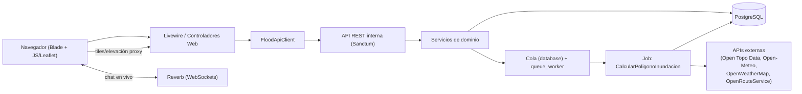
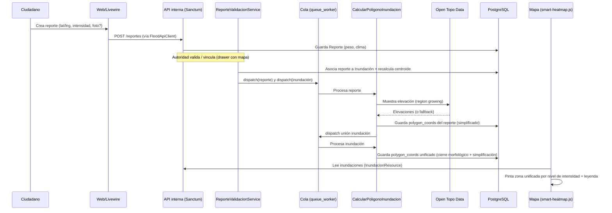

<div align="center">
  <h1>📐 SCD — Documento de Configuración y Diseño de Software</h1>
  <p><strong>Sistema de Gestión de Inundaciones (SGI) — Santa Cruz de la Sierra, Bolivia</strong></p>
</div>

> Documento técnico que describe la **arquitectura**, los **componentes principales**, las **dependencias** y el **flujo de datos** del sistema. Sirve como referencia para desarrollo, mantenimiento y onboarding.

---

## 1. Visión General

El SGI es una plataforma web para **monitorear, validar y visualizar inundaciones urbanas** combinando reportes ciudadanos (crowdsourcing) con un **motor topográfico** que simula cómo se acumula el agua según el terreno. El resultado se muestra como un **mapa de calor por intensidad** sobre Leaflet.

Características diferenciadoras:
- **Quórum dinámico con TTL**: las inundaciones se confirman/expiran al vuelo según el peso de reportes vivos (3 h).
- **Topografía inteligente**: polígonos de área inundable calculados por elevación del terreno (SRTM 30 m).
- **Unificación de zona**: los reportes de una misma inundación se fusionan en una sola mancha mediante cierre morfológico.
- **Contornos optimizados**: simplificación Douglas-Peucker (≤150 vértices) para rendimiento en mapa, API y Livewire.
- **Mapa de calor por niveles de intensidad** (baja/media/alta) con leyenda y etiquetas.
- **Validación geográfica**: minimapas inline en cada fila + drawer lateral para vincular reportes pendientes a inundaciones cercanas (≤300 m).

---

## 2. Arquitectura

### 2.1 Estilo arquitectónico

Monolito **Laravel** con un patrón interno **"Frontend → API"**:

- La capa **web (Blade + Livewire)** no consulta los modelos directamente para los flujos de negocio principales; en su lugar usa `FloodApiClient`, que invoca la **API REST interna** (`routes/api.php`) reutilizando el kernel HTTP en proceso (sin salto de red).
- La **API REST** (autenticada con **Laravel Sanctum**) es la fuente de verdad de la lógica de negocio.
- El **procesamiento pesado** (cálculo de polígonos topográficos) se delega a **colas** (`queue:work`, driver `database`).
- La **mensajería en tiempo real** (chat de autoridades) usa **Laravel Reverb** (WebSockets) + Laravel Echo.



### 2.2 Capas

| Capa | Responsabilidad | Ubicación |
|---|---|---|
| Presentación | Vistas Blade, componentes, JS de mapas | `resources/views`, `public/js` |
| Web/Controladores | Orquestación de vistas, sesión, llamadas al API interno | `app/Http/Controllers`, `app/Livewire` |
| API REST | Contratos de negocio, autenticación por token | `app/Http/Controllers/Api`, `routes/api.php` |
| Dominio/Servicios | Reglas, cálculo topográfico, validación, caché | `app/Services` |
| Asíncrono | Jobs y comandos programados | `app/Jobs`, `app/Console/Commands` |
| Datos | Modelos Eloquent + migraciones | `app/Models`, `database/migrations` |

---

## 3. Stack Tecnológico y Dependencias

### 3.1 Backend (`composer.json`)
- **PHP** `^8.3` (entorno actual: 8.4).
- **Laravel Framework** `^13.0`.
- **laravel/sanctum** — autenticación por tokens (API).
- **laravel/reverb** — servidor WebSocket para chat en vivo.
- **livewire/livewire** — componentes reactivos (p. ej. listado de reportes).
- **laravel/tinker** `^3.0`.
- Dev: **pestphp/pest** `^4`, **laravel/pint**, **mockery**, **fakerphp/faker**, **laravel/pail**, **nunomaduro/collision**.

### 3.2 Frontend (`package.json`)
- **Vite** `^8` + **laravel-vite-plugin** `^3`.
- **Tailwind CSS** `^4` (`@tailwindcss/vite`).
- **laravel-echo** `^2` + **pusher-js** `^8` (cliente Reverb).
- **axios**.
- **Leaflet 1.9.4** + **Leaflet.heat 0.2.0** (cargados por CDN en las vistas de mapa).
- **SweetAlert2** v11 (CDN en `layouts/app.blade.php`) — toasts globales para mensajes flash y confirmaciones (`confirmForm()`).

### 3.3 Datos e Infraestructura
- **PostgreSQL** (campos `jsonb` para polígonos y clima).
- **Colas**: driver `database` (tabla `jobs`).
- **Caché/Sesión**: driver `database`.
- **Docker Compose**: servicios `postgres_db`, `web_app` (`php artisan serve`), `queue_worker` (`php artisan queue:work`).

### 3.4 Servicios externos
| Servicio | Uso | Acceso |
|---|---|---|
| **Open Topo Data** (`api.opentopodata.org`, dataset `srtm30m`) | Elevación del terreno para topografía | Sin API key (público) |
| **Open-Meteo** | Precipitación actual al crear reporte | Sin API key |
| **OpenWeatherMap** | Tiles de radar de lluvia/nubes (vía proxy `WeatherController`) | API key server-side |
| **OpenRouteService** | Rutas seguras evitando zonas inundadas | API key (`OPEN_ROUTE_SERVICE_KEY`) |
| **OpenTopography** | Reservado/futuro proveedor de elevación | `OPENTOPOGRAPHY_API_KEY` (server-side, aún no consumida) |
| CartoDB / OpenStreetMap / ESRI | Tiles base y relieve | Público |

> **Seguridad de claves:** todas las API keys viven en `.env` (incluido en `.gitignore`) y se referencian vía `config/services.php`. Nunca se inyectan en el HTML/JS salvo la de OpenRouteService, que el cliente necesita para rutas (limitada por dominio en el proveedor).

---

## 4. Componentes Principales

### 4.1 Modelos de dominio (`app/Models`)
- **`Inundacion`** — entidad central. Calcula al vuelo: `quorumTotal()`, `intensidadCalculada()` (voto ponderado por peso), `estaConfirmada()` (quórum ≥ 5), `recalcularCentroide()`. Guarda `polygon_coords`, `polygon_geojson`, flags de fallback/edición autoridad. TTL = 3 h.
- **`Reporte`** — reporte ciudadano. `peso` = 1 (sin foto) / 3 (con foto). Tiene su propio `polygon_coords` topográfico. Relación con `Inundacion`.
- **`User`** — ciudadanos y autoridades (`carnet` como clave, rol `authority`).
- Soporte de otros módulos: `Victima`, `Vehiculo`, `HistorialUbicacionVehiculo`, `DanoMaterial`, `CentroAsistencia`, `Inventario`, `TrazabilidadInventario`, `Donacion`, `ChatMessage`, `Sugerencia`, `Provincia`, `Municipio`, `ClimaCache`.

### 4.2 Servicios (`app/Services`)
- **`TopografiaInundacionService`** — núcleo geoespacial:
  - `calcularResultado()` — region growing sobre grilla de elevación (celda 25 m, tolerancia 0.5 m, radios por intensidad 100/200/300 m); fallback geométrico si no hay datos.
  - `chainBoundaryEdges()` — extrae el contorno de celdas inundadas; si el contorno no cierra o supera ~400 vértices, usa **envolvente convexa** como fallback (evita polígonos rotos de miles de puntos).
  - `unirPoligonosReportes()` — **cierre morfológico** (rasterizar → dilatar → erosionar → componentes conexas) para fusionar polígonos de reportes en una zona unificada (celda 10 m, puente 100 m). Devuelve `Polygon` o `MultiPolygon`.
  - Todos los polígonos generados pasan por **`PolygonSimplifier`** antes de persistirse.
- **`ElevationService`** (implementa `ElevationProvider`) — consulta Open Topo Data por lotes (100 puntos, ~1 req/s) con caché de 24 h.
- **`PoligonoTopografiaCacheService`** — construye GeoJSON (`Polygon`/`MultiPolygon`), **simplifica** `polygon_coords` y persiste en `Reporte`/`Inundacion`.
- **`ReporteValidacionService`** — valida/vincula reportes y **dispara los jobs** de topografía (reporte + unión de inundación).
- **`FloodApiClient`** — puente Web→API interna (reutiliza el kernel HTTP).
- **`GeoLocationService`** — utilidades de geolocalización.

### 4.3 Contratos y Soporte
- **`App\Contracts\ElevationProvider`** — interfaz de proveedor de elevación (enlazada a `ElevationService` en `AppServiceProvider`).
- **`App\Support\PolygonCoordsHelper`** — normaliza coordenadas single-ring vs MultiPolygon y valida geometría.
- **`App\Support\PolygonSimplifier`** — reduce contornos densos a polígonos livianos:
  - **Douglas-Peucker** en metros (tolerancia inicial 2.5 m).
  - Tope de **150 vértices** por anillo (`MAX_VERTICES`).
  - Envolvente convexa para anillos >200 puntos (p. ej. contornos fallidos de ~10 000 vértices).
  - Se aplica al calcular topografía, al persistir y vía comando de mantenimiento.

### 4.4 Jobs y Comandos
- **`Jobs\CalcularPoligonoInundacion`** — `ShouldQueue`. Calcula el polígono de un **reporte** (region growing) o de una **inundación** (unión de los polígonos de sus reportes). Reentrante: tras calcular un reporte, re-dispara la unión de su inundación. Respeta `polygon_editado_autoridad`.
- **`Commands\RecalcularPoligonosInundacion`** (`topografia:recalcular-inundaciones`) — backfill/recálculo manual de polígonos.
- **`Commands\SimplificarPoligonos`** (`topografia:simplificar-poligonos`) — optimiza `polygon_coords` ya guardados (reportes e inundaciones). Opciones: `--solo-activas`, `--force`. Regenera `polygon_geojson` y caché.
- **`Commands\UpdateInundacionesStatus`** — actualización periódica de estado.
- **`Commands\BackfillInundacionMunicipios`** — relleno de municipios.

### 4.5 API REST (`routes/api.php`)
- `auth/*` (register/login/me/logout), `reportes` (alta rápida pública), `reports` CRUD (Sanctum), `reportes/{id}/validar`, `citizens/search`, `authorities/promote`, `centros` CRUD, `tracking/ping`.
- Recursos: **`InundacionResource`** expone datos calculados (quórum, intensidad, confirmación, desglose) + polígonos + reportes activos.

### 4.6 Capa Web (`routes/web.php`)
- Auth de sesión (`AuthController`), módulo **`reports.*`** (Livewire modular + `ReportController`), `command-center.*`, `vehiculos.*`, `victimas.*`, `inventario.*`, `logistica.*`, `authorities.*`, `chat.*`, `profile.*`, `sugerencias.*`.
- Proxies: `weather/tiles/...` (`WeatherController`), `api/elevation` (`ElevationController`).
- Middleware: **`ApiAuthenticate`** (token en sesión), **`EnsureApiAuthority`** (rol autoridad), **`RedirectIfApiAuthenticated`**.
- **UX global:** SweetAlert2 en `layouts/app.blade.php` — toasts para `session('success'|'error'|'status')` y helper `confirmForm()` para confirmaciones destructivas (p. ej. eliminar víctimas).
- **Navegación de reportes:** menú desplegable **Reportes** en `layouts/app.blade.php` (`<x-reports.nav-dropdown>`), con badge de pendientes para autoridades (contador vía `View::composer` en `AppServiceProvider`).

#### Rutas Livewire del módulo de reportes

| Ruta | Componente | Acceso | Descripción |
|------|------------|--------|-------------|
| `GET /reports` | `ReportsHub` | Sesión | Vista general: mapa, inundaciones activas, previsualización (5 filas) de pendientes/rechazados |
| `GET /reports/mis-reportes` | `ReportsMisReportes` | Sesión | Reportes enviados por el usuario |
| `GET /reports/historial` | `ReportsHistorial` | Sesión | Inundaciones terminadas (paginado 15) |
| `GET /reports/pendientes` | `ReportsPendientes` | Autoridad | Cola completa de validación (paginado 10) |
| `GET /reports/rechazados` | `ReportsRechazados` | Autoridad | Auditoría con filtros (paginado 15) |
| `GET /reports/create`, `POST /reports` | `ReportController` | Sesión | Alta de reportes |
| `GET /reports/{id}` | `ReportController` | Sesión | Ficha de reporte |

> Las rutas específicas (`/reports/pendientes`, `/reports/rechazados`, etc.) se registran **antes** de `/reports/{id}` para evitar colisiones.

### 4.7 Livewire — Panel de reportes (modular)

El antiguo monolito **`ReportsIndex`** fue sustituido por **varios componentes Livewire** que comparten lógica vía traits y partials Blade reutilizables.

#### Componentes (`app/Livewire/`)

| Clase | Vista | Rol |
|-------|-------|-----|
| `ReportsHub` | `reports-hub.blade.php` | Hub principal: mapa, filtros geo, inundaciones activas, preview de pendientes/rechazados (máx. 5 filas c/u) |
| `ReportsPendientes` | `reports-pendientes.blade.php` | Tabla paginada (10) + drawer/modales de validación |
| `ReportsRechazados` | `reports-rechazados.blade.php` | Tabla paginada (15) + barra de filtros + modales |
| `ReportsMisReportes` | `reports-mis-reportes.blade.php` | Reportes del ciudadano autenticado |
| `ReportsHistorial` | `reports-historial.blade.php` | Historial de inundaciones terminadas |

#### Traits compartidos (`app/Livewire/Concerns/`)

- **`ManagesReportValidation`** — estado de filtros rechazados (`filtroRechazoMotivo`, `filtroRechazoValidador`, `filtroRechazoDesde`, `filtroRechazoHasta`), queries `queryReportesPendientes()` / `queryReportesRechazados()`, modales de historial y modificación, `updateEstadoValidacion()`, `limpiarFiltrosRechazados()`.
- **`SerializesInundaciones`** — serialización de inundaciones activas/terminadas para tablas y mapa.

#### Partials Blade (`resources/views/components/reports/`)

| Archivo | Uso |
|---------|-----|
| `styles.blade.php` | CSS compartido (glass, minimapas, filtros, botones de validación) |
| `pending-table.blade.php` | Tabla 5 columnas de pendientes |
| `rejected-table.blade.php` | Tabla 5 columnas de rechazados (botones **Modificar** + **Ver historial**) |
| `filter-bar.blade.php` | Filtros de rechazados (motivo, validador, rango de fechas); recibe props explícitas desde Livewire |
| `pagination.blade.php` | Paginación reutilizable |
| `nav-dropdown.blade.php` | Submenú Reportes en barra superior |
| `validation-scripts.blade.php` | JS de validación rápida, modales y review drawer (envuelto en `wire:ignore`) |
| `modals/historial.blade.php` | Modal Livewire de historial de validación |
| `modals/modificar-rechazado.blade.php` | Modal Livewire para modificar reporte rechazado |

#### Hub (`ReportsHub`) — vista general

- Mapa principal (`<x-reports-map>`) con rutas seguras y reportes pendientes en capa.
- **Inundaciones activas:** tabla expandible con quórum, desglose de puntos, renovación TTL (`renovarReporte`).
- **Previsualización autoridad:** hasta **5** pendientes y **5** rechazados, con enlaces permanentes a las subpáginas completas.
- Ciudadanos ven tarjeta resumen con enlace a **Mis reportes**.
- Tarjeta **Historial de inundaciones** con enlace a `/reports/historial`.

#### Panel «Pendientes de Validación» (tabla `report-validation-table`, 5 columnas)

| Columna | Implementación |
|---------|----------------|
| Foto | Thumbnail; `openImageModal()` |
| Reporte | N°, Fecha (`created_at`), Reportado por (`citizen`) |
| Detalles | Descripción; fila 50/50 Dirección + **Intensidad propuesta** (pill `intensity-pill-*`); enlace *Ver detalle completo* → `openReportDetailModal()` |
| Mapa | `#report-minimap-pending-{id}` con `wire:ignore`; `report-minimaps.js` |
| Acciones | **Aprobar** (`validarRapido(id,'crear')`); **Vincular** (`openReviewDrawer()`); **Rechazar** |

En `/reports/pendientes`: misma tabla, paginación 10, scripts de validación completos.

#### Panel «Reportes Rechazados» (misma tabla, 5 columnas)

| Columna | Implementación |
|---------|----------------|
| Foto | Mismo markup que pendientes |
| Reporte | N°, Fecha, Reportado por, **Rechazado** (`rechazado_at`), **Validador**, **Motivo** |
| Detalles | Descripción; Dirección + Intensidad propuesta (50/50); badges GPS/lluvia/peso |
| Mapa | `#report-minimap-rejected-{id}`; minimapa vía `report-minimaps.js` |
| Acciones | **Modificar** → modal Livewire (`abrirModificarRechazado`); **Ver historial** → modal Livewire (`verHistorial`) |

En `/reports/rechazados`: barra de filtros (`<x-reports.filter-bar>`), paginación 15, botón **Limpiar filtros** cuando hay criterios activos. **No** hay exportación CSV.

#### Sistema de diseño en paneles de validación

- **Labels:** `.report-field-label` — texto `#71717A`, uppercase.
- **Valores:** `.report-field-value` — texto `#1F2937`.
- **Cabeceras `th`:** `#1F2937`, padding alineado con celdas.
- **Botones:** Aprobar/Guardar `#059669`; Vincular `#2563EB`; Rechazar fondo `#F3F4F6` texto `#DC2626`; Modificar `#EEF2FF` / `#4338CA`.
- **Filtros:** grid `.report-filter-grid` con controles `.report-filter-control`.
- **Enlace detalle:** `.report-detail-link` `#4F46E5`.

#### JavaScript de minimapas (`public/js/report-minimaps.js`)

Extraído del Blade monolítico anterior. Responsabilidades:

- **`initReportLocationMinimap()`** — Leaflet por fila: marcador azul (GPS), rojo (evento), polyline y distancia.
- **Zoom dinámico** — `fitBounds` con `maxZoom` según distancia GPS↔evento (`maxZoomForDistance`).
- **Tooltips** cortos «GPS» / «Evento».
- **Lazy init** — `IntersectionObserver` para instanciar mapas solo al entrar en viewport.
- Registry `reportMinimaps`; re-inicialización tras `livewire:navigated` y morph (debounce).
- Contenedores con `wire:ignore`.

#### Review Drawer y modales auxiliares

- **`#review-drawer`** (z-index 2500+): vinculación con mapa ampliado e inundaciones cercanas (≤300 m). Confirmación → `POST /api/reportes/{id}/validar`.
- **`#rejectModal`**, **`#approveModal`**, **`#imageModal`**, **`#reportDetailModal`**: validación rápida y detalle (scripts en `validation-scripts.blade.php`, envueltos en `wire:ignore`).
- Modales Livewire: historial de validación y modificación de rechazados.

#### Refresco en tiempo real

- Listeners Livewire: `refreshReports`, Echo `ReporteCreado`, `InundacionActualizada` (en hub y pendientes).
- Confirmaciones SweetAlert2 en acciones de validación.

> **Legacy:** `reports-index.blade.php` y `ReportsIndex.php` permanecen en el repo pero **no están enrutados**; la referencia activa es el módulo modular descrito arriba.

### 4.8 Frontend de mapas (`public/js` + partials)
- **`smart-heatmap.js`** — render del mapa de calor. Una **capa por nivel de intensidad** con color azul fijo (baja `#7dd3fc`, media `#0ea5e9`, alta `#1e3a8a`); el peso de cada punto modula sólo la opacidad. Radio del blob fijado en **metros reales** convertidos a píxeles por zoom (mantiene la forma a cualquier escala). Muestreo dentro del polígono (paso 12 m) o fallback geométrico.
- **`flood-outline.js`** — fusiona en el cliente todos los polígonos de los reportes de una inundación en un **único contorno suavizado** (cierre morfológico + suavizado de Chaikin; convex hull de respaldo). Usado para el contorno de selección y como respaldo de unificación de la zona de calor.
- **`safe-routing.js`** — rutas seguras (OpenRouteService) evitando inundaciones.
- **`report-minimaps.js`** — minimapas inline en tablas de validación (GPS vs evento, zoom adaptativo, lazy load).

> Los scripts de validación rápida (drawer, modales de aprobar/rechazar) viven en `components/reports/validation-scripts.blade.php` e incluyen Leaflet compartido con el mapa principal.

---

## 5. Modelo de Datos (tablas clave)

| Tabla | Campos relevantes |
|---|---|
| `inundaciones` | `id`, `latitud`/`longitud` (`decimal:7`), `estado` (activa/terminada/falsa), `municipio_id`, `validador_id`, `polygon_coords` (jsonb), `polygon_geojson` (jsonb), `polygon_calculado_at`, `polygon_editado_autoridad`, `polygon_es_fallback`, timestamps |
| `reportes` | `id`, `inundacion_id` (FK), `citizen_carnet`/`user_uuid`, `lat_gps`/`long_gps`, `lat_reporte`/`long_reporte`, `address`, `description`, `intensidad_propuesta` (baja/media/alta), `peso`, `foto_path`, `estado_validacion`, `datos_clima_json`, `polygon_coords`, `polygon_geojson`, `polygon_calculado_at`, `polygon_es_fallback`, timestamps |
| Otras | `users`, `victimas`, `vehiculos`, `historial_ubicacion_vehiculos`, `danos_materiales`, `centros_asistencia`, `inventario`, `chat_messages`, `sugerencias`, `provincias`/`municipios`, `clima_cache`, `jobs`, `cache` |

Constantes de negocio: `Inundacion::TTL_HORAS = 3`, `Inundacion::UMBRAL_QUORUM = 5`, `Reporte::PESO_SIN_FOTO = 1`, `Reporte::PESO_CON_FOTO = 3`.

---

## 6. Flujo de Datos Principal (reporte → mapa de calor)



### Reglas de visualización del mapa de calor
1. Se prioriza el **polígono unificado de la inundación** (aunque sea fallback). Si no existe, se fusionan los polígonos de reportes en el cliente (`flood-outline.js`). Solo como último recurso se pintan manchas por reporte.
2. El **color** lo determina `intensidadCalculada()` de la inundación (no la densidad de puntos). Inundaciones distintas → colores distintos; reportes de la misma inundación → una sola zona/color.
3. El **radio del blob** se fija en metros reales y escala con el zoom para evitar círculos sueltos a gran acercamiento.
4. Un **polígono editado por autoridad** (`polygon_editado_autoridad`) tiene prioridad absoluta y no se sobrescribe.

---

## 7. Procesamiento Asíncrono y Recálculo

- **Automático**: al validar/vincular un reporte, `ReporteValidacionService::dispatchTopografia()` encola el cálculo del reporte y la unión de la inundación; el contenedor `queue_worker` los procesa. Los polígonos resultantes se **simplifican** automáticamente (≤150 vértices/anillo).
- **Manual — recálculo topográfico** (backfill/recuperación):
  ```bash
  php artisan topografia:recalcular-inundaciones
  ```
  Útil para datos previos a la lógica de unificación o cuando el worker estuvo caído / la API de elevación falló.
- **Manual — optimización de contornos existentes**:
  ```bash
  php artisan topografia:simplificar-poligonos --solo-activas
  ```
  Reduce polígonos densos ya guardados (p. ej. contornos rotos de ~10 000 puntos) y regenera GeoJSON/caché. Opción `--force` simplifica aunque el anillo ya sea pequeño.

> **Nota técnica:** si el extractor de contorno (`chainBoundaryEdges`) no cierra el polígono, puede acumular vértices hasta el límite interno (~10 000). La simplificación y el fallback a envolvente convexa convierten esos casos en contornos estables y livianos.

---

## 8. Configuración y Entorno

- **Zona horaria**: `config/app.php` usa `env('APP_TIMEZONE', 'America/La_Paz')`; `.env` define `APP_TIMEZONE=America/La_Paz` (UTC‑4, Santa Cruz/Bolivia). Todos los `created_at`/`updated_at` se guardan y muestran en hora local de Bolivia.
- **Colas**: `QUEUE_CONNECTION=database` (requiere worker activo).
- **Claves**: `OPEN_ROUTE_SERVICE_KEY`, `OPENTOPOGRAPHY_API_KEY`, credenciales OpenWeatherMap — solo en `.env`.
- **Cacheado**: tras cambiar `.env`/config ejecutar `php artisan config:clear` (y reiniciar `queue_worker`).
- **Vistas compiladas**: tras cambios en Blade, `php artisan view:clear` (especialmente en Docker/WSL si los cambios no se reflejan).

### 8.1 Resguardo de datos (PostgreSQL / Docker)

El stack de [`docker-compose.yml`](../../docker-compose.yml) (carpeta `equipo04/`) persiste PostgreSQL en el volumen nombrado **`equipo04_pgdata`**. Cada clon o carpeta distinta del repo puede crear **otro volumen** (p. ej. `cambios_equipo04_pgdata`) con datos **antiguos de otra copia del proyecto**; no asumir que ese volumen es el entorno activo.

**Comandos que pueden vaciar la BD de desarrollo:**

| Comando | Riesgo |
|---------|--------|
| `docker compose down -v` | **Elimina el volumen** `equipo04_pgdata` y todos los datos. |
| `php artisan migrate:fresh` / `migrate:fresh --seed` | Borra todas las tablas y las recrea vacías. |
| `php artisan test` **dentro de `web_app`** si los tests usan `RefreshDatabase` contra PostgreSQL | Puede ejecutar `migrate:fresh` sobre la BD real (ver `phpunit.xml`: debe ser `sqlite` + `:memory:`). |

**Buenas prácticas:**

1. **Nunca** usar `docker compose down -v` salvo que quieras borrar la BD a propósito.
2. Ejecutar tests **desde el host** (con `phpunit.xml` apuntando a SQLite) o verificar antes de correr tests en Docker que `config('database.default')` sea `sqlite`.
3. Tras `migrate` en desarrollo, si la BD quedó vacía, repoblar con `php artisan db:seed` (desde `equipo04/`: `docker compose exec web_app php artisan db:seed`).
4. Para inspeccionar volúmenes sin tocarlos: `docker volume ls` y comparar fechas de reportes con `psql` solo en el volumen que usa **este** compose (`equipo04_pgdata`).
5. **No reasignar** el volumen del compose a otro nombre (`external: true`) sin confirmar fechas de `reportes.updated_at`; un volumen viejo puede ser de otra copia del repo.

**Incidente conocido (jun 2026):** tras `migrate` + `db:seed --class=MotivoRechazoSeeder` + `php artisan test` en el contenedor, la BD activa (`equipo04_pgdata`) quedó con esquema migrado pero **sin usuarios ni reportes**. Causa probable: `RefreshDatabase` en tests apuntando a PostgreSQL de desarrollo. Los tests del repo deben usar SQLite en memoria (`phpunit.xml`); los Feature tests incluyen una guarda que aborta si la conexión no es `sqlite`.

---

## 9. Autenticación y Roles

- **API**: tokens **Sanctum** (`personal_access_tokens`).
- **Web**: el token se guarda en sesión (`api_token`); `ApiAuthenticate` lo valida y `EnsureApiAuthority` restringe acciones a autoridades.
- **Roles**: ciudadano (reporta) vs **autoridad** (valida reportes, edita polígonos, gestiona logística/flota/víctimas/inventario, chat).

---

## 10. Mapa de Directorios (resumen)

```
cosa web/chirper/
├── app/
│   ├── Console/Commands/      # topografia:recalcular-inundaciones, topografia:simplificar-poligonos, ...
│   ├── Contracts/             # ElevationProvider
│   ├── Events/                # ChatMessageSent (Reverb)
│   ├── Http/
│   │   ├── Controllers/       # Web
│   │   ├── Controllers/Api/   # API REST (Sanctum)
│   │   ├── Middleware/        # ApiAuthenticate, EnsureApiAuthority, ...
│   │   └── Resources/         # InundacionResource, ...
│   ├── Jobs/                  # CalcularPoligonoInundacion
│   ├── Livewire/              # ReportsHub, ReportsPendientes, ReportsRechazados, …
│   │   └── Concerns/          # ManagesReportValidation, SerializesInundaciones
│   ├── Models/                # Inundacion, Reporte, ...
│   ├── Providers/             # AppServiceProvider (bind ElevationProvider, badge pendientes)
│   ├── Services/              # Topografia, Elevation, Cache, Validacion, FloodApiClient
│   └── Support/               # PolygonCoordsHelper, PolygonSimplifier
├── tests/Unit/                # TopografiaInundacionServiceTest, PolygonSimplifierTest, ...
├── database/migrations/       # esquema (inundaciones, reportes, polígonos, módulos)
├── public/js/                 # smart-heatmap.js, flood-outline.js, safe-routing.js, report-minimaps.js
├── resources/views/
│   ├── livewire/              # reports-hub, reports-pendientes, reports-rechazados, …
│   ├── components/reports/    # partials compartidos (tablas, filtros, modales, nav)
│   └── ...                    # command-center, victimas, vehiculos, …
├── routes/                    # web.php, api.php
├── config/                    # app.php (timezone), services.php (claves)
└── docker-compose.yml         # postgres_db, web_app, queue_worker
```

---

*Documento vivo: actualícese ante cambios de arquitectura, nuevos servicios externos o cambios en el flujo topográfico/mapa de calor.*
